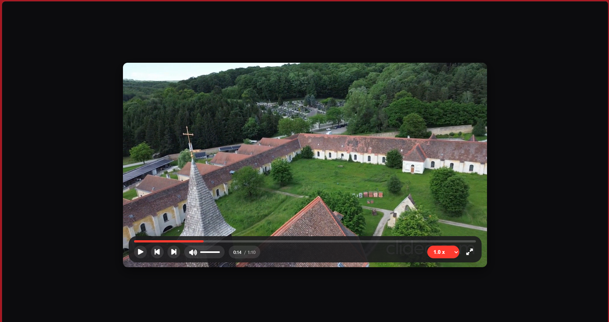

# 🎬 Custom Video Player

A clean, keyboard-accessible **HTML5 Video Player** built from scratch using **Vanilla JavaScript, HTML, and CSS**.
It features smooth interactions, intuitive controls, and a polished UI inspired by modern video platforms.

---

## 🌐 Live Demo

🚀 https://custom-video-player-zeta.vercel.app/


---

## 📸 Screenshot



---

## 🚀 Features

* ▶️ Play / Pause toggle
* ⏩ Forward & ⏪ Rewind (10 seconds)
* 📊 Smooth progress bar scrubbing
* 🔊 Volume control with dynamic icon states
* 🔇 Smart mute/unmute (state preserved)
* ⚡ Playback speed control
* 🖥️ Fullscreen support
* ⌨️ Elegant keyboard shortcut system
* 🎯 Clean and minimal UI

---

## 🎮 Keyboard Shortcuts

| Key     | Action          |
| ------- | --------------- |
| `Space` | Play / Pause    |
| `→`     | Forward 10s     |
| `←`     | Rewind 10s      |
| `↑`     | Increase volume |
| `↓`     | Decrease volume |
| `M`     | Mute / Unmute   |
| `F`     | Fullscreen      |

---

## 🛠️ Tech Stack

* HTML5
* CSS3
* JavaScript (Vanilla)

---

## 📂 Project Structure

/video-player
├── Index.html
├── style.css
├── app.js
└── videofinal.mp4

---

## ⚙️ How to Run Locally

1. Clone the repository:

   ```
   git clone https://github.com/drishtiguptaa/video-player.git
   ```
2. Open the project folder
3. Run `Index.html` in your browser

---

## 🚀 Deployment

Deployed using **Vercel**

---

## 👩‍💻 Author

**Drishti Gupta**
GitHub: https://github.com/drishtiguptaa

---

## 📜 License

Free to use and open-source.
